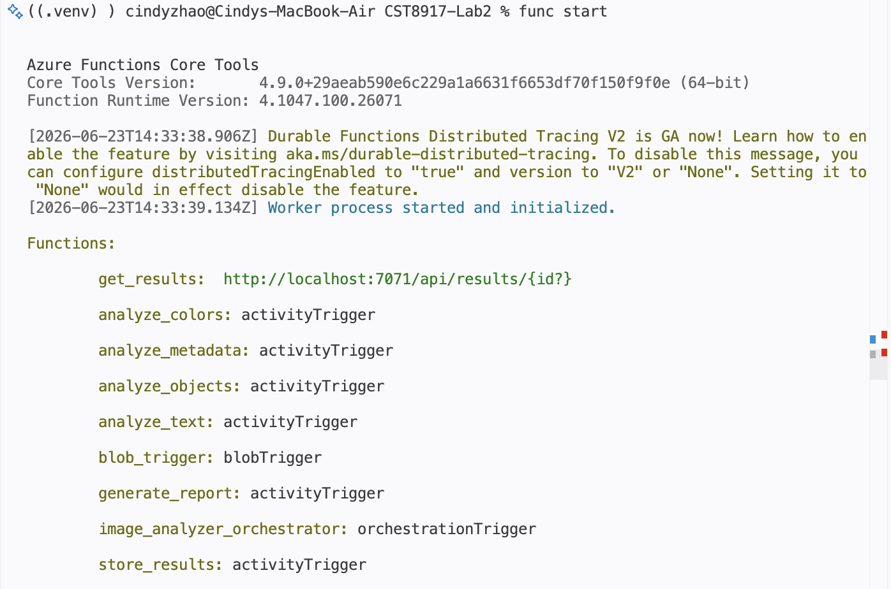
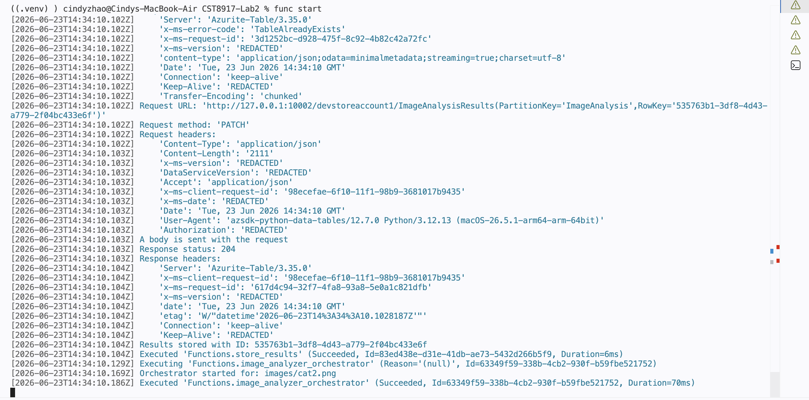
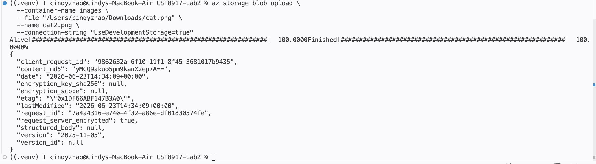
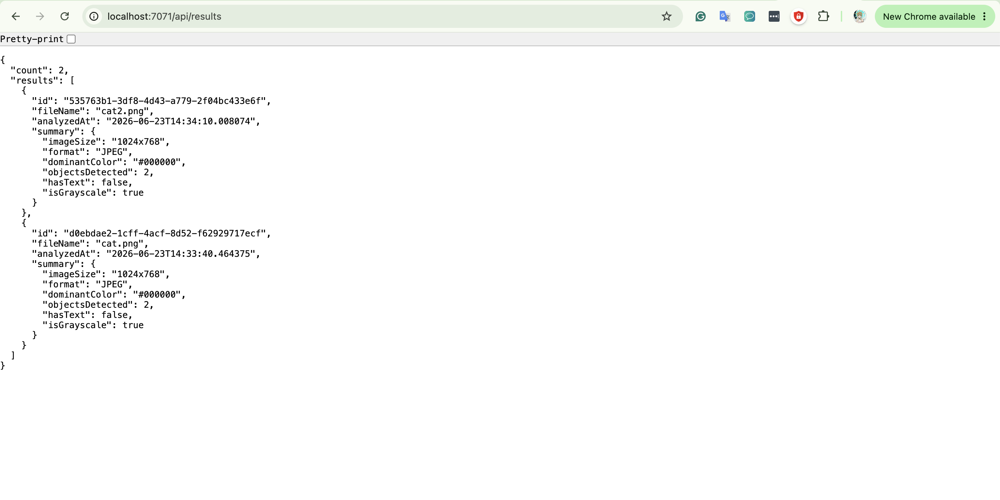
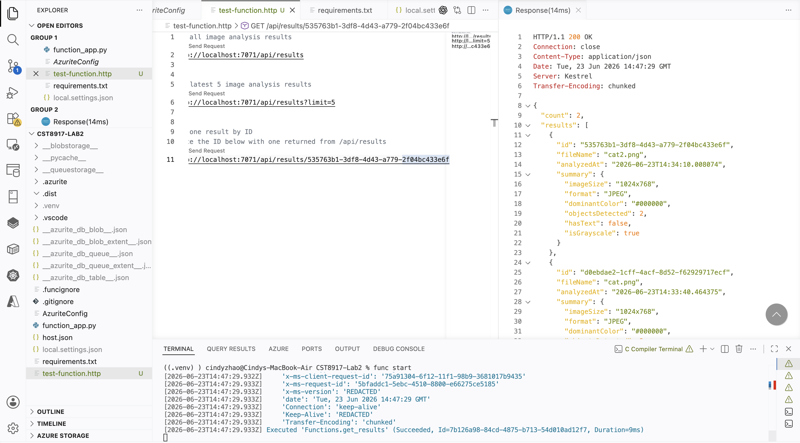

# Smart Image Analyzer with Durable Functions

## CST8917 – Serverless Applications

### Student Information

**Name:** Xinyi Zhao  
**Course:** CST8917 – Serverless Applications  
**Semester:** Spring/Summer 2026

## Demo Video

YouTube Video Link:

[Add YouTube Video Link Here]

---

## Project Overview

This project demonstrates the implementation of the **Fan-Out/Fan-In pattern** using Azure Durable Functions.

When an image is uploaded to Azure Blob Storage, a Blob Trigger automatically starts a Durable Function orchestration. The orchestrator executes four image analysis activities in parallel:

- Analyze Colors
- Analyze Objects
- Analyze Text (OCR)
- Analyze Metadata

After all activities complete, the results are combined into a single report and stored in Azure Table Storage. The stored results can then be retrieved through an HTTP endpoint.

---

## Architecture

### Fan-Out/Fan-In Workflow

```text
Image Upload
      │
      ▼
 Blob Trigger
      │
      ▼
 Durable Orchestrator
      │
 ┌────┼────┬────┐
 ▼    ▼    ▼    ▼
Colors Objects Text Metadata
 └────┼────┴────┘
      ▼
 Generate Report
      ▼
 Store Results
      ▼
 Azure Table Storage
      ▲
      │
 HTTP Endpoint
```

---

## Azure Services Used

- Azure Functions
- Azure Durable Functions
- Azure Blob Storage
- Azure Table Storage
- Azure Application Insights
- Azure Storage Account

---

## Function Components

### Client Function

| Function | Type | Description |
|-----------|------|-------------|
| blob_trigger | Blob Trigger | Detects image uploads and starts orchestration |

### Orchestrator

| Function | Type | Description |
|-----------|------|-------------|
| image_analyzer_orchestrator | Orchestration Trigger | Coordinates the workflow |

### Activity Functions

| Function | Purpose |
|-----------|---------|
| analyze_colors | Extract dominant colors |
| analyze_objects | Simulated object detection |
| analyze_text | Simulated OCR analysis |
| analyze_metadata | Extract image metadata |
| generate_report | Generate combined report |
| store_results | Store analysis results |

### HTTP Function

| Function | Purpose |
|-----------|---------|
| get_results | Retrieve stored analysis results |

---

## Deployment

The application was successfully deployed to Azure and tested using Azure Blob Storage and Azure Table Storage.

Testing included:

- Uploading images to Blob Storage
- Triggering Durable Function orchestrations
- Executing activities in parallel
- Generating analysis reports
- Storing results in Azure Table Storage
- Retrieving results through the HTTP endpoint

---

## Analysis

This lab demonstrates how the Fan-Out/Fan-In pattern improves efficiency by allowing multiple independent tasks to execute simultaneously.

Rather than processing image analyses sequentially, the orchestrator runs all four analysis activities in parallel and waits for completion using `context.task_all()`. The collected results are then combined into a unified report and stored for future retrieval.

This approach improves scalability and reduces total processing time compared to traditional sequential workflows.

---

## Findings

- Azure Blob Storage successfully triggered Durable Function orchestration.
- Parallel activity execution worked as expected using Fan-Out/Fan-In.
- Azure Table Storage provided efficient storage for structured analysis results.
- The HTTP endpoint successfully returned stored analysis reports.
- Durable Functions simplified workflow orchestration and state management.

---

## Screenshots

### Azure Function List

Shows all Durable Functions, activity functions, blob trigger, orchestrator, and HTTP endpoint successfully deployed and registered in Azure.



### Blob Upload Trigger

Demonstrates a image upload to Azure Blob Storage which automatically triggers the Durable Function orchestration.



### Azure Storage Blob Upload

Shows the image successfully uploaded to the Azure Storage container.



### Local HTTP Endpoint Test

Demonstrates successful retrieval of stored analysis results from the local HTTP endpoint.



### Azure HTTP Endpoint Test

Demonstrates successful retrieval of stored analysis results from the deployed Azure Function App.



---

## AI Usage Disclosure

Generative AI tools (ChatGPT) were used to assist with:

- Understanding Azure Durable Functions concepts
- Reviewing implementation logic
- Troubleshooting deployment and configuration issues
- Improving project documentation

All generated content was reviewed, modified, tested, and validated before submission.

---

## References

1. Microsoft Learn. *Azure Durable Functions Documentation*  
   https://learn.microsoft.com/en-us/azure/azure-functions/durable/

2. Microsoft Learn. *Azure Blob Storage Trigger Documentation*  
   https://learn.microsoft.com/en-us/azure/azure-functions/functions-bindings-storage-blob-trigger

3. Microsoft Learn. *Azure Table Storage Documentation*  
   https://learn.microsoft.com/en-us/azure/storage/tables/

4. Pillow Documentation  
   https://pillow.readthedocs.io/